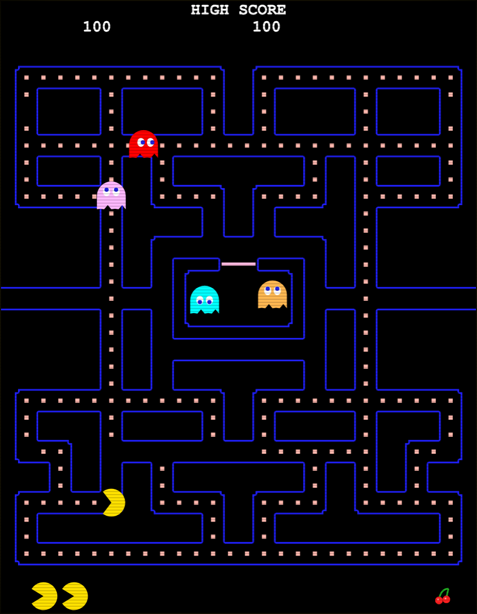

# PACMAN REDUX

An original, from-scratch homage to the 1980 arcade legend — the maze, the chase,
the waka-waka, rebuilt in vanilla JavaScript. **No original assets are used**: every
wall, sprite, fruit and sound effect is generated procedurally in code. One HTML
file, one JS file, zero dependencies.

### ▶ Play online <a href="https://pacman-redux.vercel.app" target="_blank" rel="noopener noreferrer">HERE</a>

*(Works on phones too — add it to your home screen for fullscreen play. Tip: turn your sound on.)*

<p align="center">
  <a href="https://pacman-redux.vercel.app" target="_blank" rel="noopener noreferrer">
    
  </a>
</p>

- **Repo:** https://github.com/hgardneriv/pacman-redux

> This is a tribute, not a copy. *Pac-Man* is a trademark of its respective owner;
> this project uses no original code, art, or audio — everything is drawn with
> canvas primitives and synthesized live with the Web Audio API.

## 🕹️ Controls

| | |
|---|---|
| **Desktop** | Arrow keys / WASD to move · `P` pause · `M` mute · `Enter` start |
| **Mobile** | Flick joystick (bottom-center) — tiny thumb flicks snap turns instantly — or swipe anywhere on the maze |

## 👻 The ghosts are out to get you — each in their own way

The four ghosts run the genuine 1980 brain, not a random walk:

- **Blinky** (red, *Shadow*) — locks onto your tile and hunts you down. Eat enough of
  the maze and he becomes **Cruise Elroy**, speeding up and never going home.
- **Pinky** (pink, *Speedy*) — doesn't chase *you*, she chases where you're *about to be*,
  ambushing 4 tiles ahead (faithfully including the famous up-direction overflow quirk).
- **Inky** (cyan, *Bashful*) — the wildcard: flanks using a vector doubled off Blinky's
  position, so he's only predictable if you're watching both of them.
- **Clyde** (orange, *Pokey*) — charges like Blinky until he gets within 8 tiles,
  then loses his nerve and shuffles back to his corner.

They alternate between **scatter** (corner patrol) and **chase** waves on the authentic
per-level schedule, reversing direction every time the mode flips — your only warning.

## 🍒 Faithful arcade details

- The classic 28×31 maze: 240 dots, 4 energizers, the side warp tunnel (ghosts slow
  down in it — your escape hatch)
- Per-level speed tables with a **gentler-than-arcade early ramp** — ghosts start slow
  and reach authentic 1980 speeds by level 7
- Frightened time shrinks each level (8s → 2s → …) and vanishes entirely at level 17+,
  exactly like the cabinet
- Ghost-house dot counters, post-death global counter, and starvation-timeout releases
- Fruit at 70 and 170 dots: cherry → strawberry → orange → apple → melon → rocket → bell → key
- Ghost combos 200 / 400 / 800 / 1600 · extra life at 10,000 · high score saved locally
- Rising siren as you clear the board, frightened-mode warble, eyes-returning whine,
  and an original chip-tune intro jingle

## 🚀 Run locally

Any static file server works:

```sh
python3 -m http.server 8000
# then open http://localhost:8000
```

## 📦 Files

- `index.html` — page shell, CRT scanline overlay, joystick styling
- `game.js` — the entire game (maze, ghost AI, renderer, synth audio, input)

Deploys to Vercel with zero configuration (`vercel.json` included).
